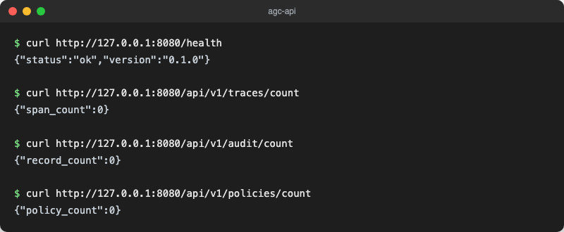

<div align="center">


# Agent Governance Console

</div>

[🇩🇪 Deutsche Version](README.de.md)

**Governance, tracing, policy enforcement and observability for agentic workflows.**

A Rust workspace for tracing, policy enforcement and audit logging of AI agent activity, with real Azure Monitor telemetry/audit export and Microsoft Graph integration; Microsoft Sentinel is still on the roadmap.

Aligned with [Microsoft's Responsible AI principles](https://learn.microsoft.com/en-us/azure/machine-learning/concept-responsible-ai) and designed for enterprise AI governance teams operating in regulated Microsoft cloud environments.

[](https://github.com/9t29zhmwdh-coder/agent-governance-console/actions)      [](https://github.com/9t29zhmwdh-coder/agent-governance-console/releases) [](LICENSE)

> **How it runs:** AGC is not a hosted service and not a desktop app. `agc-api` is a small REST API server you run yourself with `cargo run`, on `127.0.0.1:8080` by default. There is no installer and nothing runs in the background; you start and stop the process yourself.



---

> 🌱 New here? → [Step-by-step guide for beginners](GETTING_STARTED.md)

---

## Overview

Agent Governance Console (AGC) is an early-stage Rust workspace (`agc-core`, `agc-api`, `agc-cli`, `agc-azure`) for governing, observing and auditing AI agent workflows. The core library models trace spans, governance policies and audit records with a tested API; the REST API supports full trace ingestion with a real-time policy gate, policy loading, and paginated/streaming audit queries; and Azure integration (OTLP telemetry export, Managed-Identity-authenticated audit push to Azure Monitor, Microsoft Graph agent lookup) is real and wired in, not just planned (see [ROADMAP.md](ROADMAP.md)).

**In practice:** you can load a governance policy, POST agent trace spans against it, and have matching rules warn, block, or (recorded, not yet externally delivered) alert in real time, with every decision written to a queryable, exportable audit log that can be pushed to Azure Monitor. It is a real, working policy gate for a single process; multi-tenant isolation and RBAC for the REST API itself are still ahead on the roadmap.

---

## Features

| Feature | Status |
|---------|--------|
| **Trace model** (`TraceSpan`, `TraceStore`) | Available: in-memory store, sorted ingestion, tested |
| **Audit model** (`AuditRecord`, `AuditLog`) | Available: SQLite-backed (in-memory by default, or a real file via `AGC_AUDIT_DB_PATH`/`AppState::with_audit_db`), NDJSON/CSV export, paginated query, tested and exposed via API |
| **Policy model** (`GovernancePolicy`, `PolicyRule`) | Available: real condition evaluation (span level, token budget, operation glob), not just a data model |
| **Trace ingestion via API** | Available: `POST /api/v1/traces`, `GET /api/v1/traces/{trace_id}` |
| **Policy loading & real-time gating via API** | Available: `POST /api/v1/policies`; every ingested span is evaluated against loaded policies, `block` rules reject the span with `403` |
| **Audit query & export via API** | Available: `GET /api/v1/audit?limit=&offset=`, `GET /api/v1/audit/export.ndjson` / `.csv` |
| **REST API** | `/health`, `/api/v1/traces`, `/api/v1/traces/count`, `/api/v1/traces/{trace_id}`, `/api/v1/audit`, `/api/v1/audit/count`, `/api/v1/audit/export.ndjson`, `/api/v1/audit/export.csv`, `/api/v1/policies`, `/api/v1/policies/count` |
| **OTLP telemetry export to Azure Monitor** | Available: `AGC_TELEMETRY_ENDPOINT` wires a real OTLP/HTTP exporter into every ingested span |
| **Audit export to Azure Monitor (DCR)** | Available: `agc-cli azure push-audit`, Managed-Identity-authenticated, no client secret |
| **Microsoft Graph agent lookup** | Available: `agc-cli azure list-agents` (app registrations tagged `agc-agent`) |
| **YAML policy DSL** | Available: `GovernancePolicy::from_yaml` parses YAML or JSON (one parser, YAML is a JSON superset); `agc-cli policy validate` for offline checks |
| **Policy hot-reload** | Available: `AGC_POLICY_DIR` loads and live-reloads every policy file in a directory; a bad edit keeps the previous policy set instead of wiping it |
| **OPA/Rego export** | Available: `agc-cli policy to-rego` renders a structural Rego stub per policy — a hand-porting starting point, not a full semantic translation |
| **Microsoft Sentinel / REST API auth / multi-tenant** | Planned v1.0.0+, see [ROADMAP.md](ROADMAP.md) |

Full current vs. planned endpoint list: [docs/api_reference.md](docs/api_reference.md).

---

## Requirements

- Rust 1.78+
- Docker (optional, for containerised deployment)
- Azure subscription (optional, for OTLP telemetry export, audit push to Azure Monitor, and Microsoft Graph agent lookup — see [docs/azure_integration.md](docs/azure_integration.md))

---

## Quickstart

```bash
# Build all crates
cargo build --workspace

# Start API server (default: http://127.0.0.1:8080)
cargo run --bin agc-api

# Same, but persist the audit log to a real SQLite file instead of in-memory
AGC_AUDIT_DB_PATH=./agc-audit.sqlite cargo run --bin agc-api

# Health check
curl http://127.0.0.1:8080/health

# Counts
curl http://127.0.0.1:8080/api/v1/traces/count
curl http://127.0.0.1:8080/api/v1/audit/count
curl http://127.0.0.1:8080/api/v1/policies/count

# Run tests
cargo test --workspace
```

### Try the policy gate

```bash
# Load a policy that blocks anything at error level
curl -X POST http://127.0.0.1:8080/api/v1/policies -H "content-type: application/json" -d '{
  "policy_id": "p1", "name": "Error gate", "agent_scope": [],
  "rules": [{"rule_id": "r1", "description": "Block on error",
    "condition": {"type": "span_level_at_least", "level": "error"},
    "action": {"type": "block", "reason": "too severe"}}]
}'

# This span is ingested normally (201)
curl -X POST http://127.0.0.1:8080/api/v1/traces -H "content-type: application/json" -d '{
  "span_id": "3fa85f64-5717-4562-b3fc-2c963f66afa6", "trace_id": "3fa85f64-5717-4562-b3fc-2c963f66afa7",
  "parent_span_id": null, "agent_id": "agent-1", "operation": "tool_call", "level": "info",
  "started_at": "2026-07-17T12:00:00Z", "ended_at": null, "attributes": {}
}'

# This one is rejected by the policy gate (403), and never stored
curl -X POST http://127.0.0.1:8080/api/v1/traces -H "content-type: application/json" -d '{
  "span_id": "3fa85f64-5717-4562-b3fc-2c963f66afa8", "trace_id": "3fa85f64-5717-4562-b3fc-2c963f66afa7",
  "parent_span_id": null, "agent_id": "agent-1", "operation": "risky_call", "level": "error",
  "started_at": "2026-07-17T12:00:01Z", "ended_at": null, "attributes": {}
}'

# The block decision is in the audit log
curl http://127.0.0.1:8080/api/v1/audit
curl http://127.0.0.1:8080/api/v1/audit/export.csv
```

Full endpoint and policy schema reference: [docs/api_reference.md](docs/api_reference.md).

### Try the YAML policy DSL and hot-reload

```bash
mkdir -p ./policies
cat > ./policies/block-errors.yaml <<'EOF'
policy_id: p1
name: Error gate
agent_scope: []
rules:
  - rule_id: r1
    description: Block on error
    condition:
      type: span_level_at_least
      level: error
    action:
      type: block
      reason: too severe
EOF

# Validate a policy file offline, without a running server
cargo run --bin agc-cli -- policy validate ./policies/block-errors.yaml

# Start agc-api pointed at the directory: it loads every policy file at
# startup and reloads automatically whenever a file in it changes
AGC_POLICY_DIR=./policies cargo run --bin agc-api

# Render a structural Rego stub for a policy (see docs/policy_dsl.md for
# exactly what's a real translation vs. a hand-porting starting point)
cargo run --bin agc-cli -- policy to-rego ./policies/block-errors.yaml
```

### Try the Azure integration (optional)

```bash
# Provision the Azure resources once (needs an Azure subscription and az CLI)
AZURE_RG=my-rg AZURE_LOCATION=westeurope ./scripts/azure_setup.sh

# Export spans over OTLP to Azure Monitor as they're ingested
AGC_TELEMETRY_ENDPOINT="https://<region>.otelcollector.azure.com/v1/traces" cargo run --bin agc-api

# List Entra ID app registrations tagged 'agc-agent' (Managed Identity + Microsoft Graph)
cargo run --bin agc-cli -- azure list-agents

# Push a local audit export to an Azure Monitor DCR (Managed Identity, no client secret)
./scripts/export_audit.sh ndjson
cargo run --bin agc-cli -- azure push-audit --file audit-*.ndjson \
  --dce-endpoint "https://<name>.<region>-1.ingest.monitor.azure.com" \
  --dcr-id "dcr-..." --stream "Custom-AGCAudit_CL"
```

Full walkthrough, including what's mock-tested vs. verified against real Azure: [docs/azure_integration.md](docs/azure_integration.md).

---

## Uninstall / Cleanup

By default `agc-api` keeps everything in memory: stopping the process (Ctrl-C) removes all ingested data, there is nothing to clean up on disk. If you started it with `AGC_AUDIT_DB_PATH` set, the audit log persists in that SQLite file; delete it to clear audit history. Delete the `target/` build directory to reclaim build cache space.

---

## Documentation

- [Architecture](ARCHITECTURE.md)
- [Azure Integration Guide](docs/azure_integration.md)
- [Trace Schema](docs/trace_schema.md)
- [Policy DSL Reference](docs/policy_dsl.md)
- [API Reference](docs/api_reference.md)
- [Privacy & Telemetry](PRIVACY.md)
- [Roadmap](ROADMAP.md)

---

## Security

See [SECURITY.md](SECURITY.md) for vulnerability reporting. All policy decisions are logged immutably; audit records cannot be modified or deleted via the API.

---

## Contributing

See [CONTRIBUTING.md](CONTRIBUTING.md).

---

**Author:** [Rafael Yilmaz](https://github.com/9t29zhmwdh-coder) · **Status:** Early Release ·  · **License:** MIT
